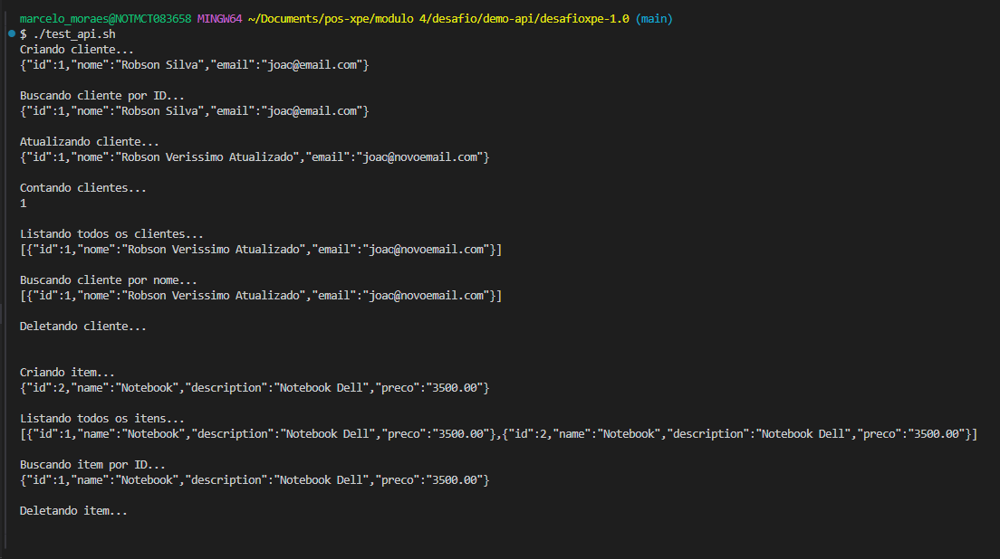

API REST - Cliente
Esta API REST foi desenvolvida com Spring Boot e fornece operações CRUD completas para a entidade Cliente, além de funcionalidades adicionais de busca e contagem.

✅ 1. Arquitetura do Software — C4 Model (Nível 1 a 3)

🔹 Nível 1 – Contexto

🔹 Nível 2 – Container

🔹 Nível 3 – Componentes


✅ 2. Estrutura de Pastas do Projeto (MVC)
src/main/java/com/example/demo/
├── controller       # Controladores REST (ClienteController, ItemController)
├── service          # Lógica de negócio (ClienteService, ItemService)
├── repository       # Interfaces JPA (ClienteRepository, ItemRepository)
├── model            # Entidades JPA (Cliente, Item)
└── ApiApplication   # Classe principal com @SpringBootApplication

✅ 3. Explicação dos Elementos do Código:
```
Model
Representa os dados da aplicação (ex: Cliente, Item)
```
Repository
Interface que comunica com o banco via Spring Data JPA
```
Service
Implementa regras de negócio e orquestra chamadas ao repositório
```
Controller
Expõe endpoints REST e interage com o Service
```
Swagger
Documenta os endpoints da API automaticamente com Springdoc OpenAPI
```
🧾 Cliente - Exemplos com curl (se aplicavel)
# Create (POST)
```    
curl -X POST http://localhost:8080/clientes \
-H "Content-Type: application/json" \
-d '{"nome": "Marcelo Silva", "email": "joao@email.com"}'
```
# Read by ID (GET)
```    
curl http://localhost:8080/clientes/1
```
# Update (PUT)
```    
curl -X PUT http://localhost:8080/clientes/1 \
-H "Content-Type: application/json" \
-d '{"nome": "Marcelo Atualizado", "email": "joao@novoemail.com"}'
```
# Delete (DELETE)
```    
curl -X DELETE http://localhost:8080/clientes/1
```
# Count
```    
curl http://localhost:8080/clientes/contar
```
# Find All
```
curl http://localhost:8080/clientes
```
# Find By Name
```   
curl http://localhost:8080/clientes/nome/Marcelo
```

📦 Item - Exemplos com curl (se aplicável)

# Create
```
curl -X POST http://localhost:8080/items \
-H "Content-Type: application/json" \
-d '{"name": "Notebook", "description": "Notebook Dell", "preco": 3500.00}'
``` 
# Find All
```
curl http://localhost:8080/items
```
# Find By ID
```
curl http://localhost:8080/items/1
```
# Delete
```
curl -X DELETE http://localhost:8080/items/1
```
# Teste


