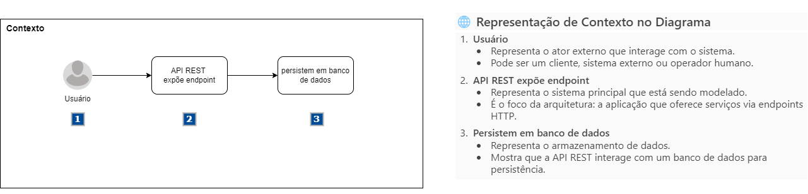
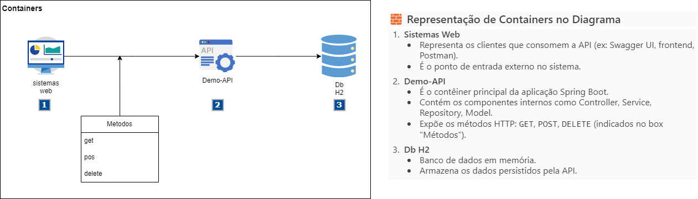
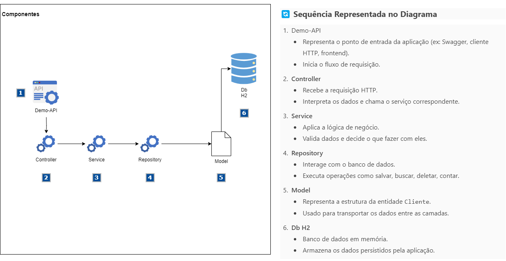

API REST - Cliente
Esta API REST foi desenvolvida com Spring Boot e fornece operações CRUD completas para a entidade Cliente, além de funcionalidades adicionais de busca e contagem.

✅ 1. Arquitetura do Software — C4 Model (Nível 1 a 3)

🔹 Nível 1 – Contexto

🔹 Nível 2 – Container

🔹 Nível 3 – Componentes

✅ 2. Estrutura de Pastas do Projeto (MVC)
src/main/java/com/example/demo/
├── controller       # Controladores REST (ClienteController, ItemController)
├── service          # Lógica de negócio (ClienteService, ItemService)
├── repository       # Interfaces JPA (ClienteRepository, ItemRepository)
├── model            # Entidades JPA (Cliente, Item)
└── ApiApplication   # Classe principal com @SpringBootApplication

✅ 3. Explicação dos Elementos do Código
Camada
Responsabilidade
Model
Representa os dados da aplicação (ex: Cliente, Item)
Repository
Interface que comunica com o banco via Spring Data JPA
Service
Implementa regras de negócio e orquestra chamadas ao repositório
Controller
Expõe endpoints REST e interage com o Service
Swagger
Documenta os endpoints da API automaticamente com Springdoc OpenAPI
